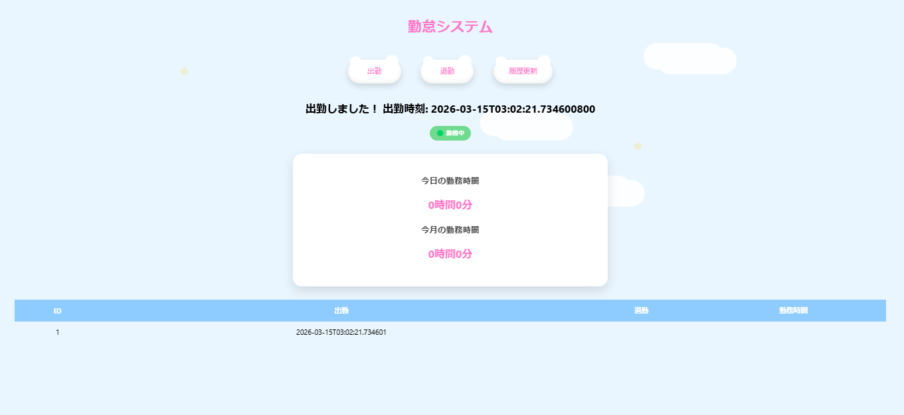
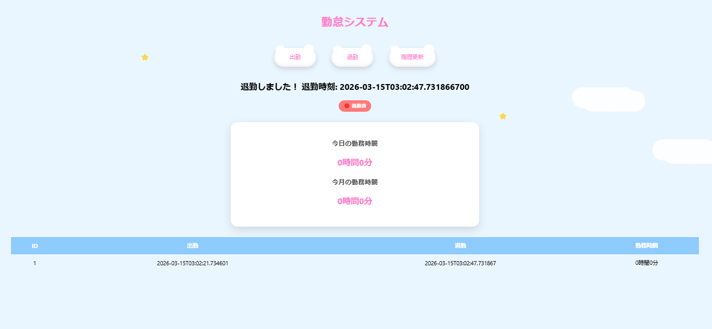

# ☁️ 勤怠管理システム

Spring Boot を使用して作成した勤怠管理アプリです。  
出勤・退勤の記録と勤務時間の自動計算を行うシンプルなWebアプリです。

雲のボタンや星のアニメーションなど、  
水色×白を基調としたユメカワ風のUIデザインを意識して制作しました。

---

## 🌟 アプリ画面

### トップ画面

### 出勤（勤務中）

### 退勤

---

## 🛠 使用技術

- Java
- Spring Boot
- Spring Data JPA
- H2 Database
- HTML
- CSS
- JavaScript
- Git / GitHub

---

## 📌 主な機能

・出勤ボタンで現在時刻を記録  
・退勤ボタンで退勤時間を登録  
・勤務時間の自動計算  
・勤怠履歴一覧表示  
・勤務中ステータス表示  

---

## 🚀 起動方法

git clone https://github.com/mirumiruchan/attendance-system.git  
cd attendance-system  
./mvnw spring-boot:run  

ブラウザでアクセス

http://localhost:8080

---

## 👩‍💻 制作者

GitHub  
https://github.com/mirumiruchan
